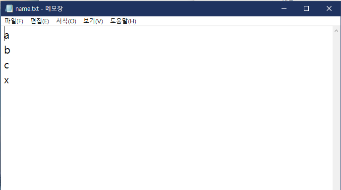

# **스터디 프로그램** 
C# 윈도우 폼을 사용한 공부 도움 서비스

컴퓨터로 공부하면서 딴짓을 못하도록 하자는 아이디어를 구현했습니다.

이 프로젝트는 대학교 2학년 과정중 C#을 처음 배운 직후 작성했던 프로젝트 입니다.
## 프로젝트 개요
### 이름
스터디 프로그램

### 기획 배경
컴퓨터로 인터넷 강의를 듣거나 여러가지 공부를 할때 책을 펴서 하는 것 보다 컴퓨터로는 할 수 있는것들이 많다보니 딴짓을 할 확률이 높다고 생각했습니다. 따라서 동기부여를 통해 공부를 돕는 프로그램을 개발하면 좋겠다는 아이디어를 토대로 진행한 프로젝트 입니다.

### 주요 기능
1. 공부와 관련한 프로그램의 동작 시간 체크
2. 동기부여를 위한 캐릭터 육성 시스템

## 프로젝트 기간
2019.06.07 ~ 2019.06.14

## 참여인원
개인 프로젝트
| 이름 | 깃허브 | 담당 역할 및 기능 | 비고 |
| ---- | ---- | ---- | ---- |
| 이효승 | [hoos007](https://github.com/hoos007) | 전체 설계 및 구현 | 신라대학교 컴퓨터소트웨어공학부 2학년 |

## 기술 스택 및 환경
### 환경
 

### 개발
 

## 실행화면
메인화면

유저관리

감지 프로세스 관리

로그인 후

공부 프로그램 감지

게임 프로세스 감지

육성 시스템

## 기능구현
우선 모든 기능은 기본적으로 txt파일을 사용해 저장기능과 로드기능을 구현합니다.
